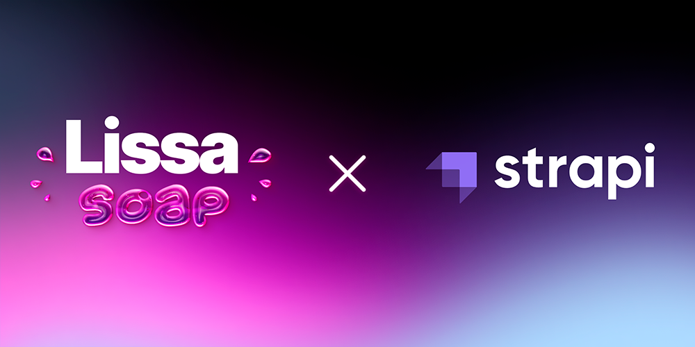

> LissaSoapCMS is a part of [LissaSoap](https://github.com/steezy2401/LissaSoap) project built to manage content of the shop

<a target="_blank" href="https://github.com/steezy2401/LissaSoap">LissaSoap</a> -
  <a target="_blank" href="https://www.figma.com/file/bomTpDTopZ08W7P3jBGhtm/LissaSoap-App-Design?node-id=0%3A1">Figma Design</a> -
  <a target="_blank" href="">Website</a> -
  <a target="_blank" href="https://www.linkedin.com/in/steezy2401/">LinkedIn</a>

 

# About

**LissaSoapCMS** is built with [Strapi](https://strapi.io/). It is used to manage all the content of LissaSoap e-commerce shop.

---

## 🚧 Work in progress 🚧
